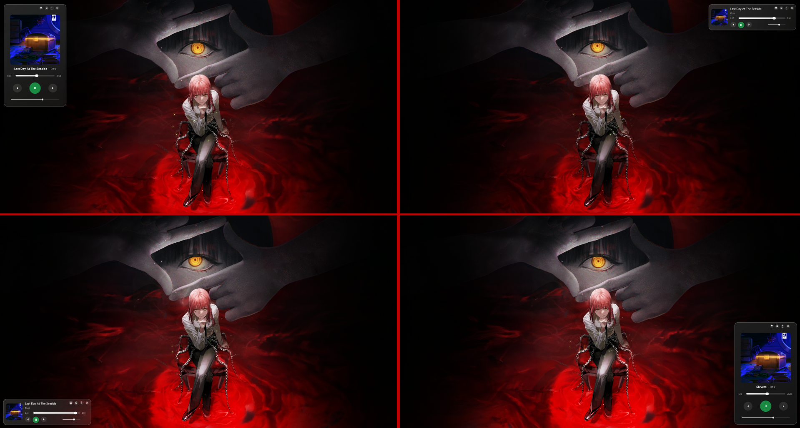
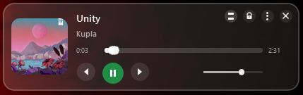
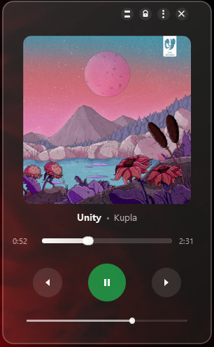

# 🎵 Spotify Widget

Want to upgrade your desktop?

A beautiful, customizable desktop widget that brings Spotify controls right to your fingertips. Built with PyQt6 and featuring a stunning glassmorphism design.



## ✨ Features

- 🎨 **Dual Themes** - Glass and Dark mode
- 📱 **Two View Modes** - Compact and Now Playing
- 🎮 **Full Playback Control** - Play, pause, next, previous
- 🔊 **Volume Control** - Direct Spotify volume adjustment
- 🔒 **Lock Position** - Pin the widget where you want
- 🎯 **Always on Top** - Keep it visible while working
- 💾 **Auto-Save Settings** - Position, theme, opacity, and more
- 🚀 **Launch Spotify** - Click the logo to open Spotify
- 🎨 **Adjustable Opacity** - 30% to 100%
- 📍 **Quick Positioning** - Snap to corners instantly

## 📸 Screenshots

### Compact Mode


### Now Playing Mode


## 🚀 Quick Start

### Download & Run (.exe - Windows only)

1. Go to the `BONUS/` folder
2. Double-click `SpotifyWidget.exe`
3. Enjoy!

**Bonus:** Use `add_to_startup.bat` (in BONUS folder, run as admin) to launch the widget automatically on Windows startup.

### Run from Source

```bash
# Clone the repository
git clone https://github.com/Piairlika/spotify-widget.git
cd spotify-widget

# Install dependencies
pip install -r requirements.txt

# Run the widget
python spotify_widget.py
```
## ⚙️ Requirements

- Windows 10/11
- Spotify Desktop Application (not browser version)
- Python 3.8+ (if running from source)

## 🎮 Controls

- **Drag** - Move the widget (when unlocked)
- **View Button** - Switch between Compact/Now Playing modes
- **Lock Button** - Lock/unlock widget position
- **Settings Button** - Open settings menu
- **Spotify Logo** - Launch Spotify app
- **Close Button** - Exit the application

## 🔧 Settings

### Theme
Choose between Glass (transparent) or Dark mode.

### Opacity
Adjust transparency from 30% to 100%.

### Default Position
Snap to screen corners:
- **TL** - Top Left
- **TR** - Top Right
- **BL** - Bottom Left
- **BR** - Bottom Right

### Always on Top
Keep the widget above other windows.

## 🛠️ Build from Source

**Note:** A pre-compiled .exe is already available in the `BONUS/` folder!

```bash
# Install PyInstaller
pip install pyinstaller

# Build executable
pyinstaller --onefile --windowed --name="SpotifyWidget" spotify_widget.py

# Find your .exe in dist/ folder
```
## 📋 Dependencies

- **PyQt6** - GUI framework
- **winsdk** - Windows Media Control API
- **pycaw** - Audio control
- **comtypes** - COM interface support

## 🎨 Customization

All settings are saved in `widget_config.json`:
- Position (x, y coordinates)
- Theme (glass/dark)
- Opacity (30-100%)
- Always on Top (true/false)
- Lock state (true/false)

## 💡 Tips

- Use **Lock** to prevent accidental movement
- **Always on Top** is great for multitasking
- **Compact mode** saves screen space
- **Now Playing mode** shows beautiful album art
- Adjust **opacity** to match your desktop aesthetic

## 📝 Credits

- Made by Piairlika
- Built with ❤️

---

Enjoy your upgraded desktop! 🎵

If you like this project, give it a ⭐ on GitHub!